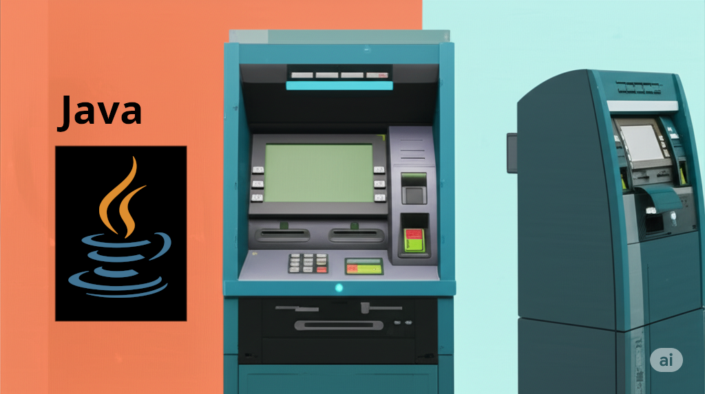

# 🏦 ContaBanco

<p align="center">
 
</p>

-----

Projeto de simulação de um terminal de conta bancária, desenvolvido como um exercício prático para reforçar os conceitos de Programação Orientada a Objetos, manipulação de entrada de dados e uso de ferramentas de build e conteinerização com Java.

A aplicação é executada no console e solicita ao usuário que insira dados como número da agência, número da conta, nome do cliente e saldo inicial. Após a inserção, uma mensagem de confirmação é exibida com os dados formatados.

## ✨ Funcionalidades

  - Recebe dados do usuário de forma interativa (Agência, Conta, Nome e Saldo).
  - Realiza a validação de formatos numéricos para garantir a integridade dos dados.
  - Utiliza `BigDecimal` para o tratamento de valores monetários, evitando erros de precisão.
  - Exibe uma mensagem de confirmação amigável com os dados da conta recém-criada.

## 🚀 Tecnologias Utilizadas

  - **Java 21**: Linguagem principal do projeto.
  - **Maven**: Gerenciador de dependências e ferramenta de build.
  - **Docker**: Plataforma de conteinerização para criar um ambiente de execução isolado e padronizado.

## 📋 Pré-requisitos

Antes de começar, garanta que você tenha as seguintes ferramentas instaladas em seu ambiente:

  - [Git](https://git-scm.com/)
  - [Java Development Kit (JDK) 21](https://www.oracle.com/java/technologies/downloads/) ou superior.
  - [Apache Maven 3.8+](https://maven.apache.org/download.cgi)
  - [Docker](https://docs.docker.com/)
  - [Docker Compose](https://docs.docker.com/compose/install/) (geralmente já incluído no Docker Desktop)

## ⚙️ Como Começar

Siga os passos abaixo para clonar, configurar e executar o projeto em sua máquina local.

### 1\. Clonando o Repositório

```bash
git clone https://github.com/lucasrosasc/ContaBanco.git
cd ContaBanco
```

### 2\. Gerando o Maven Wrapper (Opcional, mas recomendado)

O Maven Wrapper (`mvnw`) garante que todos que usam o projeto o construam com a mesma versão do Maven, evitando inconsistências de ambiente. Se os arquivos `mvnw` não estiverem no repositório, você pode gerá-los com o seguinte comando:

```bash
# O argumento -N (ou --non-recursive) garante que o comando rode apenas no diretório principal.
mvn -N wrapper:wrapper
```

Após executar, você verá a pasta `.mvn` e os arquivos `mvnw` e `mvnw.cmd` no seu projeto.

## 🏃‍♀️ Executando a Aplicação

Você pode executar a aplicação de três maneiras diferentes:

### Método 1: Diretamente com Maven

Este método utiliza o Maven instalado em sua máquina para compilar e executar o projeto.

```bash
# 1. Empacota a aplicação em um arquivo .jar
# No Windows
mvnw.cmd clean package

# No Linux ou macOS
./mvnw clean package

# 2. Executa o arquivo .jar gerado
java -jar target/ContaBanco-1.0-SNAPSHOT.jar
```

### Método 2: Usando Docker

Este método constrói uma imagem Docker e executa a aplicação dentro de um contêiner, sem precisar do Java ou Maven instalados localmente (apenas o Docker).

```bash
# 1. Constrói a imagem Docker a partir do Dockerfile
docker build -t contabanco-app .

# 2. Executa a aplicação em modo interativo
# A flag -it é essencial para que você possa digitar no console.
docker run -it --rm contabanco-app
```

### Método 3: Usando Docker Compose (Recomendado)

O Docker Compose simplifica todo o processo, usando o arquivo `docker-compose.yaml` para orquestrar o build e a execução.

```bash
# Constrói a imagem e executa o contêiner em modo interativo.
# O comando "run" é usado em vez de "up" porque é ideal para
# aplicações de console que precisam de interação do usuário.
docker-compose run --rm server
```

A flag `--rm` é adicionada para remover o contêiner automaticamente após a execução, mantendo seu ambiente limpo.

## Structure do Projeto

```
.
├── .mvn/                  # Pasta do Maven Wrapper
├── src/
│   └── main/
│       └── java/
│           └── com/
│               └── mybank/
│                   └── app/
│                       └── ContaTerminal.java  # Classe principal da aplicação
├── .dockerignore          # Arquivos a serem ignorados pelo Docker
├── .gitignore             # Arquivos a serem ignorados pelo Git
├── docker-compose.yaml    # Arquivo de orquestração do Docker Compose
├── Dockerfile             # Receita para construir a imagem Docker
├── mvnw                   # Script do Maven Wrapper (Linux/macOS)
├── mvnw.cmd               # Script do Maven Wrapper (Windows)
├── pom.xml                # Arquivo de configuração do projeto Maven
└── README.md              # Esta documentação
```

-----

Feito com ❤️ por **Lucas Rosas**.

[LinkedIn](https://www.linkedin.com/in/lucas-rosas-da-cunha/) | [GitHub](https://github.com/lucasrosasc)
